## DucksManager

[Official website](https://www.ducksmanager.net)

DucksManager is a free and open-source website enabling comic book collectors to manage their Disney collection.

Related projects :

- [WhatTheDuck](apps/whattheduck) is the mobile app of DucksManager, allowing users to check the contents of their collection on a mobile and add issues to the collection by photographing comic book covers.
- [EdgeCreator](apps/edgecreator) is a project allowing users to upload photos of edges and create models out of them in order to generate edge pictures.
- [Duck cover ID](apps/cover-updater) is a collection of shell scripts launched by a daily cronjob, allowing to retrieve comic book covers from the Inducks website and add the features of these pictures to a Pastec index. This index is searched whn taking a picture of a cover in the WhatTheDuck app.
- [COA updater](apps/coa-updater) is a shell script launched by a daily cronjob, allowing to retrieve the structure and the contents of the Inducks database and to create a copy of this database locally.
- [DucksManager-stats](apps/stats-updater) contains a list of scripts launched by a daily cronjob, allowing to calculate statistics about issues that are recommended to users on DucksManager, depending on the authors that they prefer.
- [dm-server](https://github.com/bperel/dm-server) was the back-end that DucksManager and What The Duck versions under version 3.0 used to read and write data from/to. This is now handled by the [DucksManager API](packages/api).

```mermaid
graph TB
    subgraph Inducks
        ISV_files("ISV files")
    end
    subgraph DB
        db_dm("DM DB")
        db_coa("COA DB")
        db_dm_stats("DM stats DB")
        db_cover_id("Cover info DB")
        db_edgecreator("EdgeCreator DB")
    end
    subgraph API
        /notifications/send
        /ducksmanager/emails/pending
    end
    ducksmanager.net-->API
    subgraph "dm-server (outdated, TODO move jobs to DM)"
        certificate-renewer
        db-backuper
        subgraph dm-server
            coa-updater-->ISV_files
            coa-updater-->db_coa
            stats-updater-->db_coa
            stats-updater-->db_dm
            stats-updater-->db_dm_stats
            cover-updater-->db_coa
            cover-updater-->db_cover_id
            cover-updater-->Inducks-covers
            sprite-names-updater-->db_dm
            duck-estimator-->db_coa
            subscription-handler-->db_dm
        end
        notification-sender-->db_dm
        notification-sender-->/notifications/send
        pending-emails-sender-->db_dm
        pending-emails-sender-->/ducksmanager/emails/pending
        popularity-updater-->db_dm
    end
```

## Setup

### Prerequisites

- [Node.js](https://nodejs.org/en/) 22
- [Docker](https://www.docker.com/)
- Some Unix or WSL2 environment
