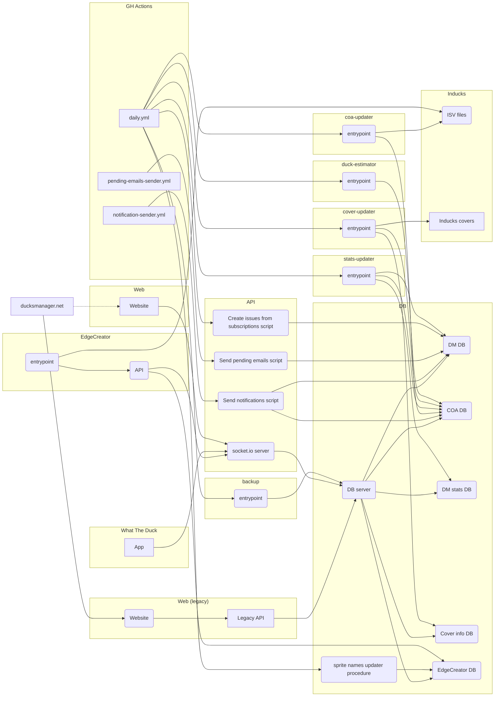

## DucksManager

[Official website](https://www.ducksmanager.net)

DucksManager is a free and open-source website enabling comic book collectors to manage their Disney collection.

Apps :

- [Web](apps/web) is the DucksManager website. It calls the backend that's stored in [packages/api](packages/api). Note that the version of web that's currently running on ducksmanager.net is the one stored in the [legacy branch](https://github.com/ducksmanager/core/tree/legacy). Eventually the `master` branch will be used.
- [What The Duck](apps/whattheduck) is the mobile app of DucksManager, allowing users to check the contents of their collection on a mobile and add issues to the collection by photographing comic book covers. It calls the backend that's stored in [packages/api](packages/api).
- [EdgeCreator](apps/edgecreator) is a project allowing users to upload photos of edges and create models out of them in order to generate edge pictures.
- [Duck cover ID](apps/cover-updater) is a collection of shell scripts launched by a daily cronjob, allowing to retrieve comic book covers from the Inducks website and add the features of these pictures to a Pastec index. This index is searched whn taking a picture of a cover in the WhatTheDuck app.
- [COA updater](apps/coa-updater) is a shell script launched by a daily cronjob, allowing to retrieve the structure and the contents of the Inducks database and to create a copy of this database locally.
- [DucksManager-stats](apps/stats-updater) contains a list of scripts launched by a daily cronjob, allowing to calculate statistics about issues that are recommended to users on DucksManager, depending on the authors that they prefer.

## Setup

### Prerequisites

- [PNPM](https://pnpm.io/)
- [Node.js](https://nodejs.org/en/) 22
- [Docker](https://www.docker.com/)
- Some Unix or WSL2 environment
