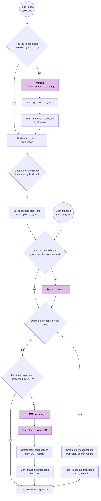

```mermaid
---
config:
  layout: dagre
---
flowchart
    A(("Page image<br>uploaded")) --> HasImageBeenProcessedByKumiko{"Has the image been processed by Kumiko yet?"}
    HasImageBeenProcessedByKumiko -- No --> Kumiko["Kumiko<br>(detect number of panels)"]
    HasImageBeenProcessedByKumiko -- Yes --> UpdateStoryKindSuggestion["Update story kind suggestion"]
    Kumiko --> SetSuggestedStoryKind["Set suggested story kind"]
    SetSuggestedStoryKind --> MarkAsKumikoProcessed["Mark image as processed<br>by Kumiko"]
    MarkAsKumikoProcessed --> UpdateStoryKindSuggestion
    UpdateStoryKindSuggestion --> DoesTheEntryAlreadyHaveAStoryKindSet{"Does the entry already<br>have a story kind set?"}
    DoesTheEntryAlreadyHaveAStoryKindSet -- no --> SetSuggestedStoryKindAsAcceptedStoryKind["Set suggested story kind<br>as accepted story kind"]
    SetSuggestedStoryKindAsAcceptedStoryKind --> HasImageBeenProcessedByStorySearch{"Has the image been processed by story search?"}
    HasImageBeenProcessedByOCR{"Has the image been processed by OCR?"} -- yes --> UpdateStorySuggestions["Update story suggestions"]
    HasImageBeenProcessedByOCR -- no --> RunOCROnImage["Run OCR on image"]
    RunOCROnImage --> FindStoriesFromOCR["Find stories from OCR"]
    FindStoriesFromOCR --> CreateStorySuggestionsFromOCR["Create story suggestions<br>from OCR results"]
    CreateStorySuggestionsFromOCR --> MarkAsOCRProcessed["Mark image as processed<br>by OCR"]
    MarkAsOCRProcessed --> UpdateStorySuggestions
    B@{ label: "User changes<br>entry's story kind" } --> HasImageBeenProcessedByStorySearch
    HasImageBeenProcessedByStorySearch -- no --> RunStorySearch["Run story search"]
    HasImageBeenProcessedByStorySearch -- yes --> HasStorySearchResults{"Did the story search yield results?"}
    RunStorySearch --> HasStorySearchResults
    HasStorySearchResults -- yes --> CreateStorySuggestions["Create story suggestions<br>from story search results"]
    HasStorySearchResults -- no --> HasImageBeenProcessedByOCR
    CreateStorySuggestions --> MarkAsStorySearchProcessed["Mark image as processed<br>by Story Search"]
    MarkAsStorySearchProcessed --> UpdateStorySuggestions
    B@{ shape: circle}
     Kumiko:::pinkNode
     RunOCROnImage:::pinkNode
     RunStorySearch:::pinkNode
     FindStoriesFromOCR:::pinkNode
    classDef pinkNode fill:#E1BEE7,color:#000000

```
